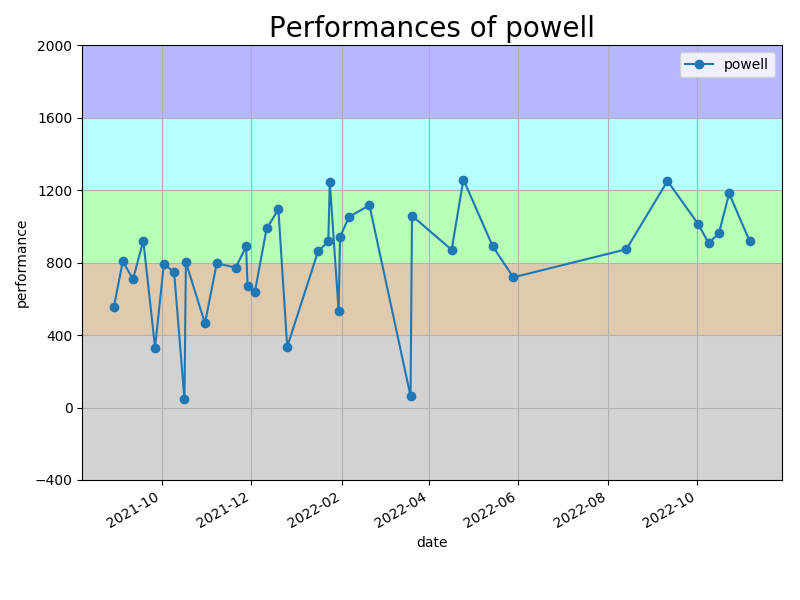

# kyopuro
競プロ用リポジトリ

## レーティング

## 言語
C++をメインで練習していますが、提出は主にPythonです。
- C++
- Python3, PyPy3
- Rust

## 環境
DockerコンテナでC++の環境を用意。
コンテナ内でPython3.7の環境を構築。
詳細は `/kyopuro/.devcontainer/` を参照。

こちらを使用させていただいています。

https://mycode.rip/how-to-prepare-competitive-programming