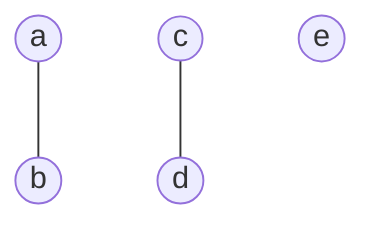
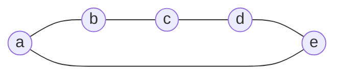
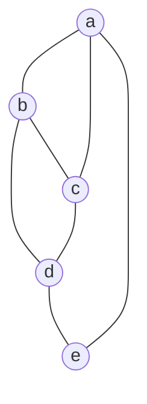
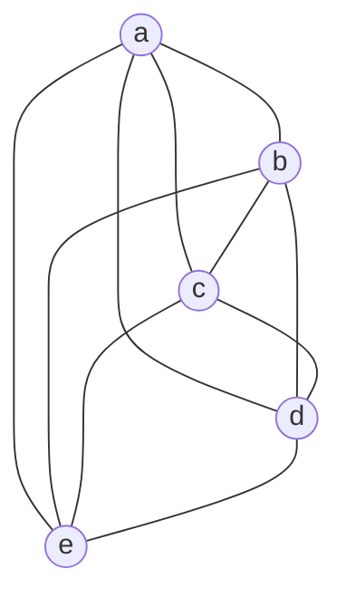

# sub07

## 方針
1. うまくバラバラになるように初期値となるグラフを構成

   （グラフの入次数を保存しておく）

1. 変化した後のグラフを、入次数でクラスタリング

## 実装
- クラスは`sub07`を流用


### 1. グラフの構成

頂点数 $5$ のグラフを分散させる

```
[5, 0, 0, 0, 0]
```


```
[1, 4, 0, 0, 0]
```



```
[0, 0, 5, 0, 0]
```



```
[0, 0, 1, 4, 0]
```




```
[0, 0, 0, 0, 5]
```



---
## スコア
$836,805,247$点
